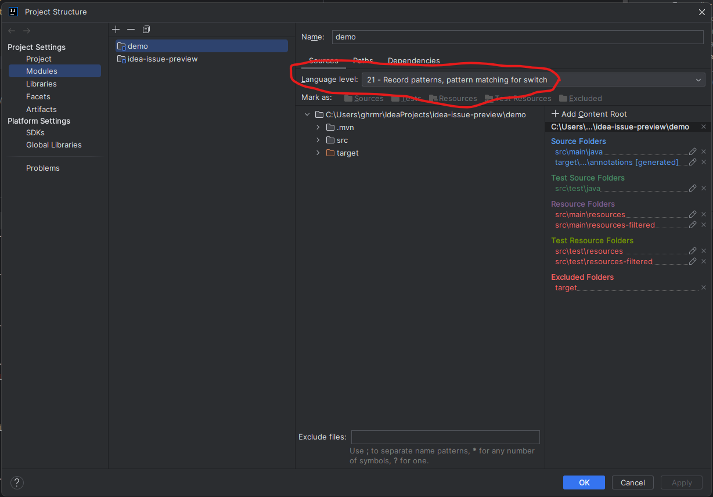
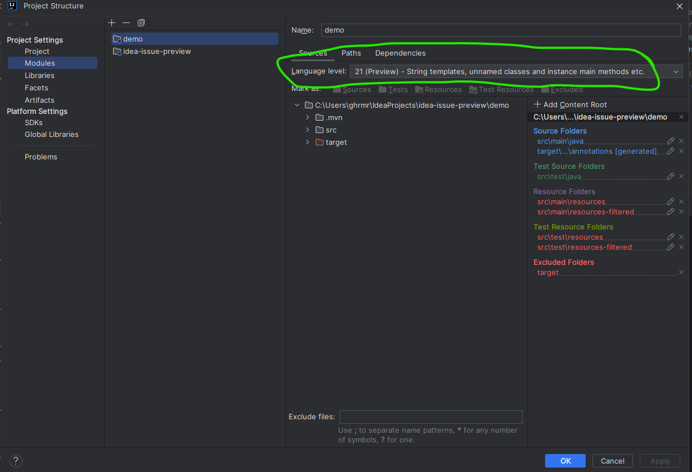

When configuring maven-compiler-plugin with <enablePreview>true</enablePreview> the change is not reflected in the module Language Level 

```xml
      <plugin>
        <groupId>org.apache.maven.plugins</groupId>
        <artifactId>maven-compiler-plugin</artifactId>
        <version>3.12.1</version>
        <configuration>
          <enablePreview>true</enablePreview>
          <parameters>true</parameters>
        </configuration>
      </plugin>
```


I would expect the same behaviour as when configuring via the compilerArgs
```xml
      <plugin>
        <groupId>org.apache.maven.plugins</groupId>
        <artifactId>maven-compiler-plugin</artifactId>
        <version>3.12.1</version>
        <configuration>
          <parameters>true</parameters>
          <compilerArgs>
            <compilerArg>--enable-preview</compilerArg>
          </compilerArgs>
        </configuration>
      </plugin>
```
